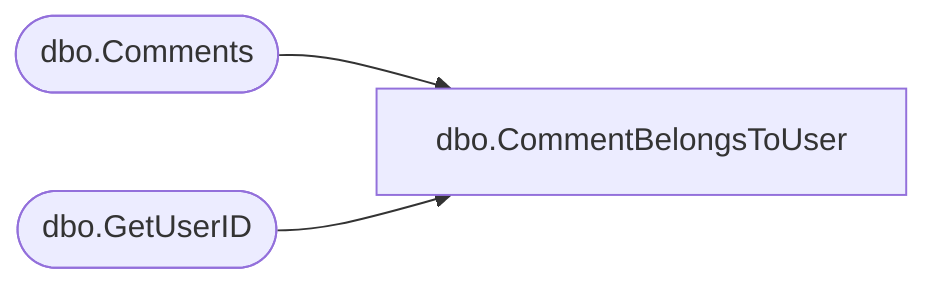

# dbo.CommentBelongsToUser

**Database:** ReportServerBIRPT02  
**Server:** bearcluster01  

## Architecture Diagram



## Table Dependencies

| Referenced Table |
|---|
| dbo.Comments |
| dbo.GetUserID |

## Stored Procedure Code

```sql
CREATE PROCEDURE [dbo].[CommentBelongsToUser]
@CommentID bigint,
@UserSid varbinary(85),
@UserName nvarchar(260),
@AuthType int
AS
BEGIN
    DECLARE @CommentOwner uniqueidentifier
    DECLARE @CurrentUser uniqueidentifier
    EXEC GetUserID @UserSid, @UserName, @AuthType, @CurrentUser OUTPUT
    SET @CommentOwner = (SELECT TOP(1) [UserID] FROM [Comments] WHERE [CommentID] = @CommentID)
    IF @CommentOwner = @CurrentUser
        SELECT 1
    ELSE
        SELECT 0
END
```

