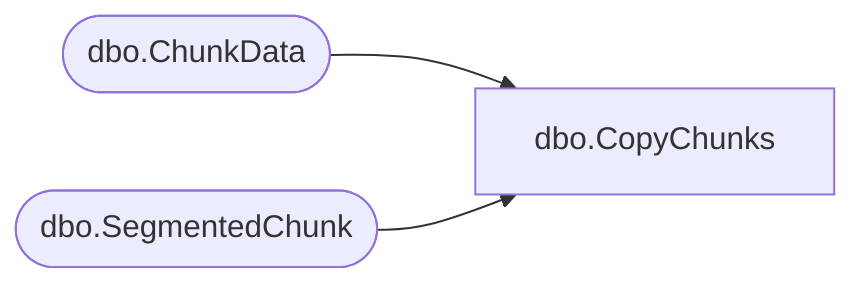

# dbo.CopyChunks

**Database:** ReportServerBIRPT02  
**Server:** bearcluster01  

## Architecture Diagram



## Table Dependencies

| Referenced Table |
|---|
| dbo.ChunkData |
| dbo.SegmentedChunk |

## Stored Procedure Code

```sql
CREATE PROCEDURE [dbo].[CopyChunks]
    @OldSnapshotId UNIQUEIDENTIFIER,
    @NewSnapshotId UNIQUEIDENTIFIER,
    @IsPermanentSnapshot BIT
AS
BEGIN
    IF(@IsPermanentSnapshot = 1) BEGIN
        -- copy non-segmented chunks
        INSERT [dbo].[ChunkData] (
            ChunkId,
            SnapshotDataId,
            ChunkFlags,
            ChunkName,
            ChunkType,
            Version,
            MimeType,
            Content
            )
        SELECT
            NEWID(),
            @NewSnapshotId,
            [c].[ChunkFlags],
            [c].[ChunkName],
            [c].[ChunkType],
            [c].[Version],
            [c].[MimeType],
            [c].[Content]
        FROM [dbo].[ChunkData] [c] WHERE [c].[SnapshotDataId] = @OldSnapshotId

        -- copy segmented chunks... real easy just add the mapping
        INSERT [dbo].[SegmentedChunk](
            ChunkId,
            SnapshotDataId,
            ChunkName,
            ChunkType,
            Version,
            MimeType,
            ChunkFlags
            )
        SELECT
            ChunkId,
            @NewSnapshotId,
            ChunkName,
            ChunkType,
            Version,
            MimeType,
            ChunkFlags
        FROM [dbo].[SegmentedChunk] WITH (INDEX (UNIQ_SnapshotChunkMapping))
        WHERE [SnapshotDataId] = @OldSnapshotId
    END
    ELSE BEGIN
        -- copy non-segmented chunks
        INSERT [ReportServerBIRPT02TempDB].dbo.[ChunkData] (
            ChunkId,
            SnapshotDataId,
            ChunkFlags,
            ChunkName,
            ChunkType,
            Version,
            MimeType,
            Content
            )
        SELECT
            NEWID(),
            @NewSnapshotId,
            [c].[ChunkFlags],
            [c].[ChunkName],
            [c].[ChunkType],
            [c].[Version],
            [c].[MimeType],
            [c].[Content]
        FROM [ReportServerBIRPT02TempDB].dbo.[ChunkData] [c] WHERE [c].[SnapshotDataId] = @OldSnapshotId

        -- copy segmented chunks... real easy just add the mapping
        INSERT [ReportServerBIRPT02TempDB].[dbo].[SegmentedChunk](
            ChunkId,
            SnapshotDataId,
            ChunkName,
            ChunkType,
            Version,
            MimeType,
            ChunkFlags,
            Machine
            )
        SELECT
            ChunkId,
            @NewSnapshotId,
            ChunkName,
            ChunkType,
            Version,
            MimeType,
            ChunkFlags,
            Machine
        FROM [ReportServerBIRPT02TempDB].dbo.[SegmentedChunk] WITH (INDEX (UNIQ_SnapshotChunkMapping))
        WHERE [SnapshotDataId] = @OldSnapshotId
    END
END
```

