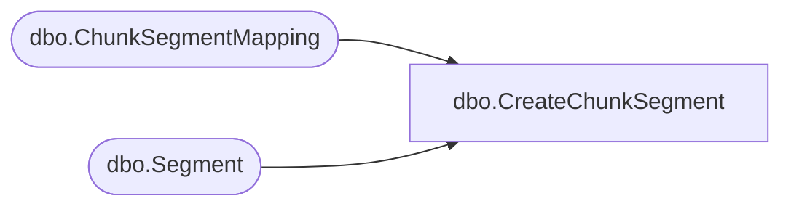

# dbo.CreateChunkSegment

**Database:** ReportServerBIRPT02  
**Server:** bearcluster01  

## Architecture Diagram



## Table Dependencies

| Referenced Table |
|---|
| dbo.ChunkSegmentMapping |
| dbo.Segment |

## Stored Procedure Code

```sql
create proc [dbo].[CreateChunkSegment]
    @SnapshotId			uniqueidentifier,
    @IsPermanent		bit,
    @ChunkId			uniqueidentifier,
    @Content			varbinary(max) = 0x0,
    @StartByte			bigint,
    @Length				int = 0,
    @LogicalByteCount	int = 0,
    @SegmentId			uniqueidentifier out
as begin
    declare @output table (SegmentId uniqueidentifier, ActualByteCount int) ;
    declare @ActualByteCount int ;
    if(@IsPermanent = 1) begin
        insert Segment(Content)
        output inserted.SegmentId, datalength(inserted.Content) into @output
        values (substring(@Content, 1, @Length)) ;

        select top 1    @SegmentId = SegmentId,
                        @ActualByteCount = ActualByteCount
        from @output ;

        insert ChunkSegmentMapping(ChunkId, SegmentId, StartByte, LogicalByteCount, ActualByteCount)
        values (@ChunkId, @SegmentId, @StartByte, @LogicalByteCount, @ActualByteCount) ;
    end
    else begin
        insert [ReportServerBIRPT02TempDB].dbo.Segment(Content)
        output inserted.SegmentId, datalength(inserted.Content) into @output
        values (substring(@Content, 1, @Length)) ;

        select top 1    @SegmentId = SegmentId,
                        @ActualByteCount = ActualByteCount
        from @output ;

        insert [ReportServerBIRPT02TempDB].dbo.ChunkSegmentMapping(ChunkId, SegmentId, StartByte, LogicalByteCount, ActualByteCount)
        values (@ChunkId, @SegmentId, @StartByte, @LogicalByteCount, @ActualByteCount) ;
    end
end
```

