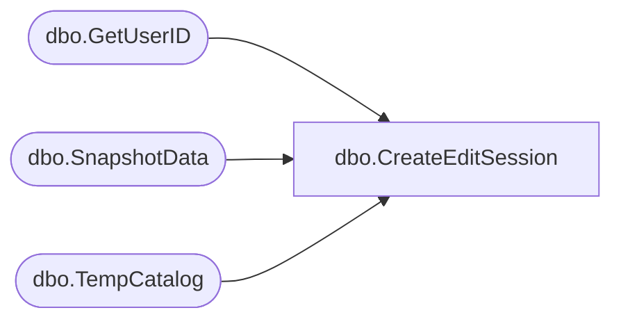

# dbo.CreateEditSession

**Database:** ReportServerBIRPT02  
**Server:** bearcluster01  

## Architecture Diagram



## Table Dependencies

| Referenced Table |
|---|
| dbo.GetUserID |
| dbo.SnapshotData |
| dbo.TempCatalog |

## Stored Procedure Code

```sql
CREATE proc [dbo].[CreateEditSession]
    @EditSessionID varchar(32),
    @ContextPath nvarchar(440),
    @Name nvarchar(440),
    @OwnerSid varbinary(85) = NULL,
    @OwnerName nvarchar(260),
    @Content varbinary(max),
    @Description nvarchar(max) = NULL,
    @Intermediate uniqueidentifier,
    @Property nvarchar(max),
    @Parameter nvarchar(max),
    @AuthType int,
    @Timeout int,
    @DataCacheHash varbinary(64) = NULL,
    @NewItemID uniqueidentifier out
as begin
    DECLARE @OwnerID uniqueidentifier ;
    EXEC GetUserID @OwnerSid, @OwnerName, @AuthType, @OwnerID OUTPUT ;

    UPDATE [ReportServerBIRPT02TempDB].dbo.SnapshotData
    SET  PermanentRefcount = PermanentRefcount + 1, TransientRefcount = TransientRefcount - 1
    WHERE SnapshotData.SnapshotDataID = @Intermediate

    SELECT @NewItemID = NEWID();

    -- copy in the report metadata
    insert into [ReportServerBIRPT02TempDB].dbo.TempCatalog (
        EditSessionID,
        TempCatalogID,
        ContextPath,
        [Name],
        Content,
        Description,
        Intermediate,
        IntermediateIsPermanent,
        Property,
        Parameter,
        OwnerID,
        CreationTime,
        ExpirationTime,
        DataCacheHash )
    values (
        @EditSessionID,
        @NewItemID,
        @ContextPath,
        @Name,
        @Content,
        @Description,
        @Intermediate,
        convert(bit, 0),
        @Property,
        @Parameter,
        @OwnerID,
        GETDATE(),
        DATEADD(n, @Timeout, GETDATE()),
        @DataCacheHash)
END
```

