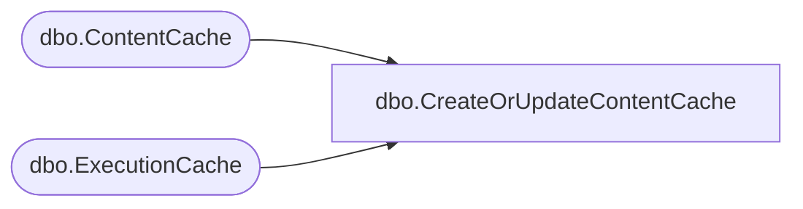

# dbo.CreateOrUpdateContentCache

**Database:** ReportServerBIRPT02  
**Server:** bearcluster01  

## Architecture Diagram



## Table Dependencies

| Referenced Table |
|---|
| dbo.ContentCache |
| dbo.ExecutionCache |

## Stored Procedure Code

```sql
CREATE PROCEDURE [dbo].[CreateOrUpdateContentCache]
    @CatalogItemID uniqueidentifier,
    @ParamsHash int,
    @EffectiveParams nvarchar(max),
    @ContentType nvarchar(256),
    @Version smallint,
    @Content varbinary(max)
AS
BEGIN
    DECLARE @ExpirationDate as DateTime
    SET @ExpirationDate = NULL

    SELECT TOP 1 @ExpirationDate = AbsoluteExpiration
    FROM
        [ReportServerBIRPT02TempDB].dbo.[ExecutionCache]
    WHERE
        ReportId = @CatalogItemID AND
        ParamsHash = @ParamsHash
    ORDER BY AbsoluteExpiration DESC

    BEGIN TRANSACTION CONTENTCACHEUPSERT
    IF NOT EXISTS (SELECT ContentCacheID FROM [ReportServerBIRPT02TempDB].[dbo].ContentCache WHERE CatalogItemID = @CatalogItemID AND ParamsHash = @ParamsHash AND  ContentType = @ContentType)
        INSERT INTO [ReportServerBIRPT02TempDB].[dbo].ContentCache
            (
                [CatalogItemID],
                [CreatedDate],
                [ParamsHash],
                [EffectiveParams],
                [ContentType],
                [ExpirationDate],
                [Version],
                [Content]
            )
        VALUES
            (
                @CatalogItemID,
                GETDATE(),
                @ParamsHash,
                @EffectiveParams,
                @ContentType,
                @ExpirationDate,
                @Version,
                @Content
            )
    ELSE
        UPDATE [ReportServerBIRPT02TempDB].[dbo].ContentCache
        SET
            [CatalogItemID] = @CatalogItemID,
            [CreatedDate] = GETDATE(),
            [ParamsHash] = @ParamsHash,
            [EffectiveParams] = @EffectiveParams,
            [ContentType] = @ContentType,
            [ExpirationDate] = @ExpirationDate,
            [Version] = @Version,
            [Content] = @Content
         WHERE CatalogItemID = @CatalogItemID AND ParamsHash = @ParamsHash AND  ContentType = @ContentType
    COMMIT TRANSACTION CONTENTCACHEUPSERT
END
```

