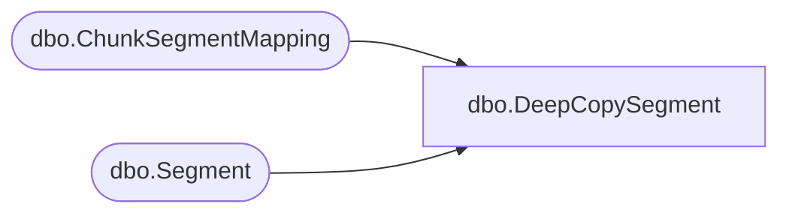

# dbo.DeepCopySegment

**Database:** ReportServerBIRPT02  
**Server:** bearcluster01  

## Architecture Diagram



## Table Dependencies

| Referenced Table |
|---|
| dbo.ChunkSegmentMapping |
| dbo.Segment |

## Stored Procedure Code

```sql
create proc [dbo].[DeepCopySegment]
    @ChunkId		uniqueidentifier,
    @IsPermanent	bit,
    @SegmentId		uniqueidentifier,
    @NewSegmentId	uniqueidentifier out
as
begin
    select @NewSegmentId = newid() ;
    if (@IsPermanent = 1) begin
        insert Segment(SegmentId, Content)
        select @NewSegmentId, seg.Content
        from Segment seg
        where seg.SegmentId = @SegmentId ;

        update ChunkSegmentMapping
        set SegmentId = @NewSegmentId
        where ChunkId = @ChunkId and SegmentId = @SegmentId ;
    end
    else begin
        insert [ReportServerBIRPT02TempDB].dbo.Segment(SegmentId, Content)
        select @NewSegmentId, seg.Content
        from [ReportServerBIRPT02TempDB].dbo.Segment seg
        where seg.SegmentId = @SegmentId ;

        update [ReportServerBIRPT02TempDB].dbo.ChunkSegmentMapping
        set SegmentId = @NewSegmentId
        where ChunkId = @ChunkId and SegmentId = @SegmentId ;
    end
end
```

