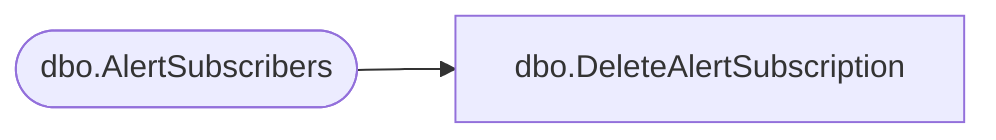

# dbo.DeleteAlertSubscription

**Database:** ReportServerBIRPT02  
**Server:** bearcluster01  

## Architecture Diagram



## Table Dependencies

| Referenced Table |
|---|
| dbo.AlertSubscribers |

## Stored Procedure Code

```sql
CREATE PROCEDURE [dbo].[DeleteAlertSubscription]
    @AlertSubscriptionID bigint
AS
BEGIN
    DELETE FROM [AlertSubscribers] WHERE
    AlertSubscriptionID = @AlertSubscriptionID
END
```

