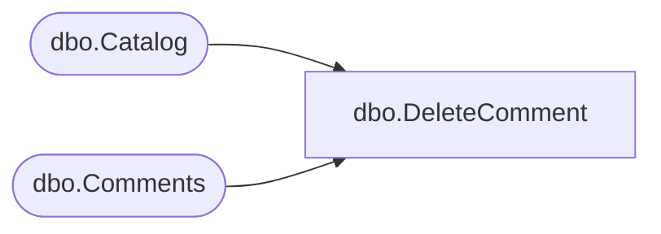

# dbo.DeleteComment

**Database:** ReportServerBIRPT02  
**Server:** bearcluster01  

## Architecture Diagram



## Table Dependencies

| Referenced Table |
|---|
| dbo.Catalog |
| dbo.Comments |

## Stored Procedure Code

```sql
CREATE PROCEDURE [dbo].[DeleteComment]
@CommentID bigint
AS
BEGIN TRAN
    DECLARE @AttachmentID uniqueidentifier;

    SELECT TOP 1 @AttachmentID = [AttachmentID]
    FROM [Comments]
    WHERE [CommentID]=@CommentID

    UPDATE [Comments]
    SET ThreadID=NULL
    WHERE [ThreadID]=@CommentID;

    DELETE FROM [Comments]
    WHERE [CommentID]=@CommentID

    IF (@AttachmentID IS NOT NULL)
        DELETE FROM [Catalog]
        WHERE [ItemID] =  @AttachmentID;
COMMIT
```

