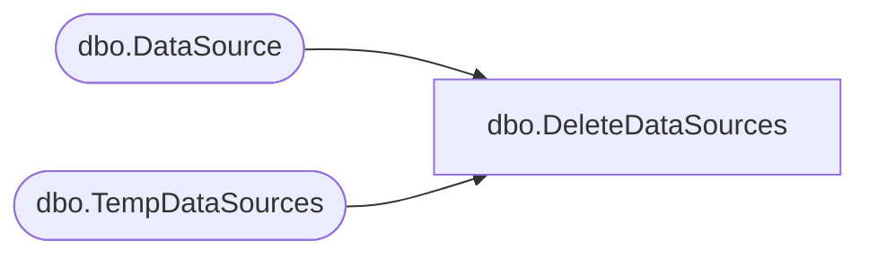

# dbo.DeleteDataSources

**Database:** ReportServerBIRPT02  
**Server:** bearcluster01  

## Architecture Diagram



## Table Dependencies

| Referenced Table |
|---|
| dbo.DataSource |
| dbo.TempDataSources |

## Stored Procedure Code

```sql
CREATE PROCEDURE [dbo].[DeleteDataSources]
@ItemID [uniqueidentifier]
AS

DELETE
FROM [DataSource]
WHERE [ItemID] = @ItemID or [SubscriptionID] = @ItemID
DELETE
FROM [ReportServerBIRPT02TempDB].dbo.TempDataSources
WHERE [ItemID] = @ItemID
```

