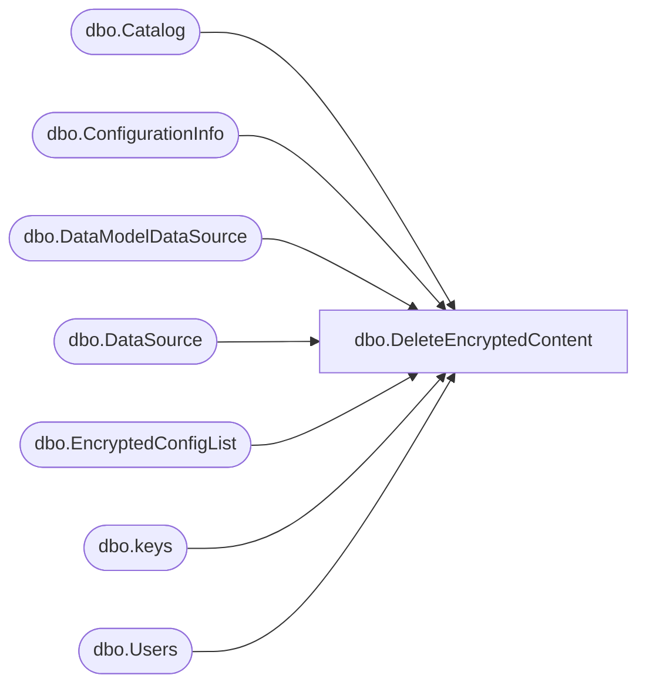

# dbo.DeleteEncryptedContent

**Database:** ReportServerBIRPT02  
**Server:** bearcluster01  

## Architecture Diagram



## Table Dependencies

| Referenced Table |
|---|
| dbo.Catalog |
| dbo.ConfigurationInfo |
| dbo.DataModelDataSource |
| dbo.DataSource |
| dbo.EncryptedConfigList |
| dbo.keys |
| dbo.Users |

## Stored Procedure Code

```sql
CREATE PROCEDURE [dbo].[DeleteEncryptedContent]
@ConfigNamesToDelete AS [dbo].[EncryptedConfigList] READONLY
AS

-- Remove the encryption keys
delete from keys where client >= 0

-- Remove the encrypted content
UPDATE [dbo].[DataSource]
SET CredentialRetrieval = 1, -- CredentialRetrieval.Prompt
    ConnectionString = null,
    OriginalConnectionString = null,
    UserName = null,
    Password = null;

-- Remove only the OAuth client secret from ConfigurationInfo
DELETE FROM [dbo].[ConfigurationInfo]
WHERE [Name] IN (SELECT [ConfigName] FROM @ConfigNamesToDelete)

UPDATE [dbo].[Users]
SET [ServiceToken] = null

-- Remove KPIs since they are encrypted; Catalog Type=11 is KPI
UPDATE [dbo].[Catalog]
SET [Property] = null
WHERE [Type] = 11

-- Remove encrypted content in DataModelDataSource
UPDATE [dbo].[DataModelDataSource]
SET ConnectionString = null,
    Username = null,
    Password = null;
```

