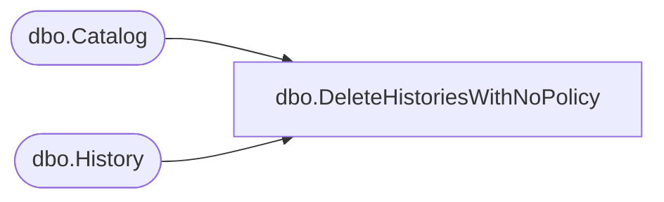

# dbo.DeleteHistoriesWithNoPolicy

**Database:** ReportServerBIRPT02  
**Server:** bearcluster01  

## Architecture Diagram



## Table Dependencies

| Referenced Table |
|---|
| dbo.Catalog |
| dbo.History |

## Stored Procedure Code

```sql
-- delete all snapshots for all reports that inherit system History policy
CREATE PROCEDURE [dbo].[DeleteHistoriesWithNoPolicy]
AS
SET NOCOUNT OFF
DELETE
FROM History
WHERE HistoryID in
   (SELECT HistoryID
    FROM History JOIN Catalog on ItemID = ReportID
    WHERE SnapshotLimit is null
   )
```

