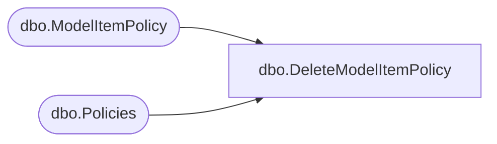

# dbo.DeleteModelItemPolicy

**Database:** ReportServerBIRPT02  
**Server:** bearcluster01  

## Architecture Diagram



## Table Dependencies

| Referenced Table |
|---|
| dbo.ModelItemPolicy |
| dbo.Policies |

## Stored Procedure Code

```sql
CREATE PROCEDURE [dbo].[DeleteModelItemPolicy]
@CatalogItemID as uniqueidentifier,
@ModelItemID as nvarchar(425)
AS
SET NOCOUNT OFF
DECLARE @PolicyID uniqueidentifier
SELECT @PolicyID = (SELECT PolicyID FROM ModelItemPolicy WHERE CatalogItemID = @CatalogItemID AND ModelItemID = @ModelItemID)
DELETE Policies FROM Policies WHERE Policies.PolicyID = @PolicyID
```

