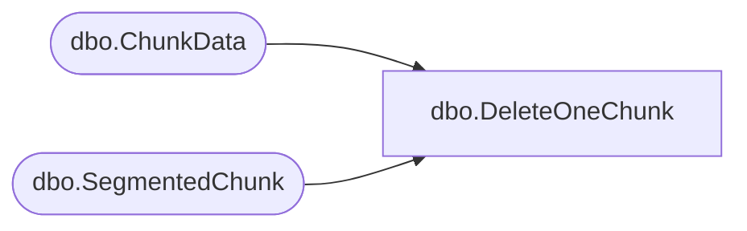

# dbo.DeleteOneChunk

**Database:** ReportServerBIRPT02  
**Server:** bearcluster01  

## Architecture Diagram



## Table Dependencies

| Referenced Table |
|---|
| dbo.ChunkData |
| dbo.SegmentedChunk |

## Stored Procedure Code

```sql
CREATE PROCEDURE [dbo].[DeleteOneChunk]
@SnapshotID uniqueidentifier,
@IsPermanentSnapshot bit,
@ChunkName nvarchar(260),
@ChunkType int
AS
SET NOCOUNT OFF
-- for segmented chunks we just need to
-- remove the mapping, the cleanup thread
-- will pick up the rest of the pieces
IF @IsPermanentSnapshot != 0 BEGIN

DELETE ChunkData
WHERE
    SnapshotDataID = @SnapshotID AND
    ChunkName = @ChunkName AND
    ChunkType = @ChunkType

DELETE	SegmentedChunk
WHERE
    SnapshotDataId = @SnapshotID AND
    ChunkName = @ChunkName AND
    ChunkType = @ChunkType

END ELSE BEGIN

DELETE [ReportServerBIRPT02TempDB].dbo.ChunkData
WHERE
    SnapshotDataID = @SnapshotID AND
    ChunkName = @ChunkName AND
    ChunkType = @ChunkType

DELETE	[ReportServerBIRPT02TempDB].dbo.SegmentedChunk
WHERE
    SnapshotDataId = @SnapshotID AND
    ChunkName = @ChunkName AND
    ChunkType = @ChunkType

END
```

