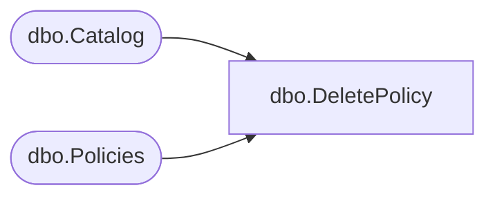

# dbo.DeletePolicy

**Database:** ReportServerBIRPT02  
**Server:** bearcluster01  

## Architecture Diagram



## Table Dependencies

| Referenced Table |
|---|
| dbo.Catalog |
| dbo.Policies |

## Stored Procedure Code

```sql
CREATE PROCEDURE [dbo].[DeletePolicy]
@ItemName as nvarchar(425)
AS
SET NOCOUNT OFF
DECLARE @OldPolicyID uniqueidentifier
SELECT @OldPolicyID = (SELECT PolicyID FROM Catalog WHERE Catalog.Path = @ItemName)
UPDATE Catalog SET PolicyID =
(SELECT Parent.PolicyID FROM Catalog Parent, Catalog WHERE Parent.ItemID = Catalog.ParentID AND Catalog.Path = @ItemName),
PolicyRoot = 0
WHERE Catalog.PolicyID = @OldPolicyID
DELETE Policies FROM Policies WHERE Policies.PolicyID = @OldPolicyID
```

