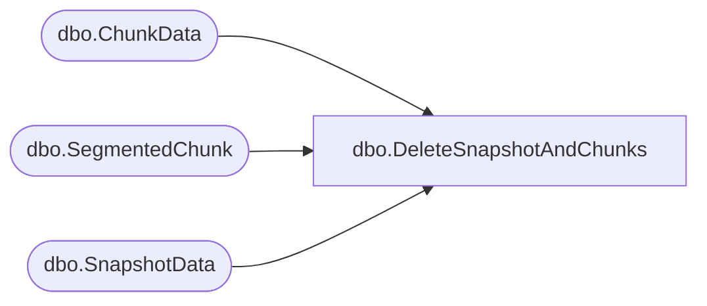

# dbo.DeleteSnapshotAndChunks

**Database:** ReportServerBIRPT02  
**Server:** bearcluster01  

## Architecture Diagram



## Table Dependencies

| Referenced Table |
|---|
| dbo.ChunkData |
| dbo.SegmentedChunk |
| dbo.SnapshotData |

## Stored Procedure Code

```sql
CREATE PROCEDURE [dbo].[DeleteSnapshotAndChunks]
@SnapshotID uniqueidentifier,
@IsPermanentSnapshot bit
AS

-- Delete from Snapshot, ChunkData and SegmentedChunk table.
-- Shared segments are not deleted.
-- TODO: currently this is being called from a bunch of places that handles exceptions.
-- We should try to delete the segments in some of all of those cases as well.
IF @IsPermanentSnapshot != 0 BEGIN

    DELETE ChunkData
    WHERE ChunkData.SnapshotDataID = @SnapshotID

    DELETE SegmentedChunk
    WHERE SegmentedChunk.SnapshotDataId = @SnapshotID

    DELETE SnapshotData
    WHERE SnapshotData.SnapshotDataID = @SnapshotID

END ELSE BEGIN

    DELETE [ReportServerBIRPT02TempDB].dbo.ChunkData
    WHERE SnapshotDataID = @SnapshotID

    DELETE [ReportServerBIRPT02TempDB].dbo.SegmentedChunk
    WHERE SnapshotDataId = @SnapshotID

    DELETE [ReportServerBIRPT02TempDB].dbo.SnapshotData
    WHERE SnapshotDataID = @SnapshotID

END
```

