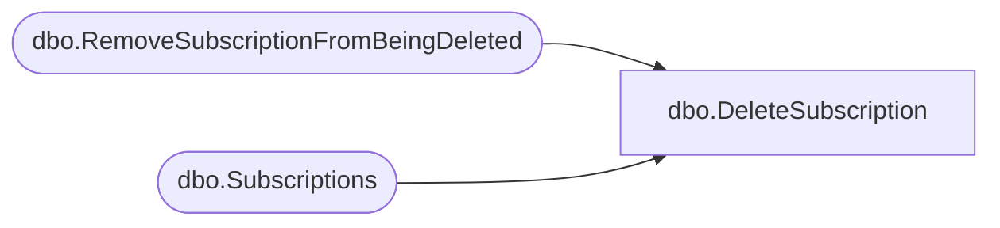

# dbo.DeleteSubscription

**Database:** ReportServerBIRPT02  
**Server:** bearcluster01  

## Architecture Diagram



## Table Dependencies

| Referenced Table |
|---|
| dbo.RemoveSubscriptionFromBeingDeleted |
| dbo.Subscriptions |

## Stored Procedure Code

```sql
CREATE PROCEDURE [dbo].[DeleteSubscription]
@SubscriptionID uniqueidentifier
AS
    -- Delete the subscription
    delete from [Subscriptions] where [SubscriptionID] = @SubscriptionID
    -- Delete it from the SubscriptionsBeingDeleted
    EXEC RemoveSubscriptionFromBeingDeleted @SubscriptionID
```

