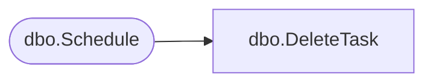

# dbo.DeleteTask

**Database:** ReportServerBIRPT02  
**Server:** bearcluster01  

## Architecture Diagram



## Table Dependencies

| Referenced Table |
|---|
| dbo.Schedule |

## Stored Procedure Code

```sql
CREATE PROCEDURE [dbo].[DeleteTask]
@ScheduleID uniqueidentifier
AS
SET NOCOUNT OFF
-- Delete the task with the given task id
DELETE FROM Schedule
WHERE [ScheduleID] = @ScheduleID
```

