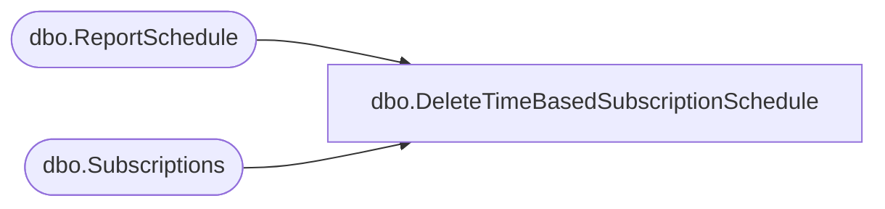

# dbo.DeleteTimeBasedSubscriptionSchedule

**Database:** ReportServerBIRPT02  
**Server:** bearcluster01  

## Architecture Diagram



## Table Dependencies

| Referenced Table |
|---|
| dbo.ReportSchedule |
| dbo.Subscriptions |

## Stored Procedure Code

```sql
CREATE PROCEDURE [dbo].[DeleteTimeBasedSubscriptionSchedule]
@SubscriptionID as uniqueidentifier
as

delete ReportSchedule from ReportSchedule RS inner join Subscriptions S on S.[SubscriptionID] = RS.[SubscriptionID]
where
    S.[SubscriptionID] = @SubscriptionID
```

