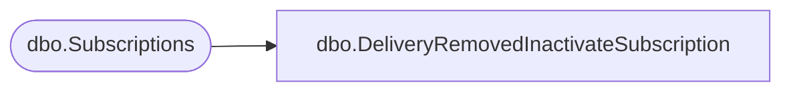

# dbo.DeliveryRemovedInactivateSubscription

**Database:** ReportServerBIRPT02  
**Server:** bearcluster01  

## Architecture Diagram



## Table Dependencies

| Referenced Table |
|---|
| dbo.Subscriptions |

## Stored Procedure Code

```sql
CREATE PROCEDURE [dbo].[DeliveryRemovedInactivateSubscription]
@DeliveryExtension nvarchar(260),
@Status nvarchar(260)
AS
update
    Subscriptions
set
    [DeliveryExtension] = '',
    [InactiveFlags] = [InactiveFlags] | 1, -- Delivery Provider Removed Flag == 1
    [LastStatus] = @Status
where
    [DeliveryExtension] = @DeliveryExtension
```

