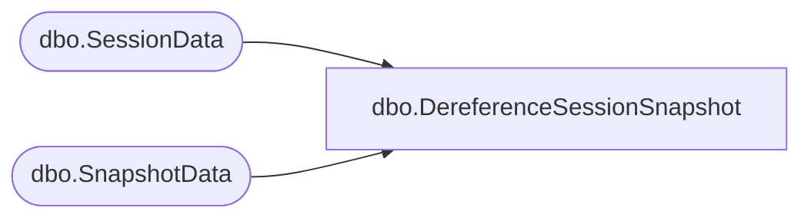

# dbo.DereferenceSessionSnapshot

**Database:** ReportServerBIRPT02  
**Server:** bearcluster01  

## Architecture Diagram



## Table Dependencies

| Referenced Table |
|---|
| dbo.SessionData |
| dbo.SnapshotData |

## Stored Procedure Code

```sql
CREATE PROCEDURE [dbo].[DereferenceSessionSnapshot]
@SessionID as varchar(32),
@OwnerID as uniqueidentifier
AS

UPDATE SN
SET TransientRefcount = TransientRefcount - 1
FROM
   SnapshotData AS SN
   INNER JOIN [ReportServerBIRPT02TempDB].dbo.SessionData AS SE ON SN.SnapshotDataID = SE.SnapshotDataID
WHERE
   SE.SessionID = @SessionID AND
   SE.OwnerID = @OwnerID

UPDATE SN
SET TransientRefcount = TransientRefcount - 1
FROM
   [ReportServerBIRPT02TempDB].dbo.SnapshotData AS SN
   INNER JOIN [ReportServerBIRPT02TempDB].dbo.SessionData AS SE ON SN.SnapshotDataID = SE.SnapshotDataID
WHERE
   SE.SessionID = @SessionID AND
   SE.OwnerID = @OwnerID
```

