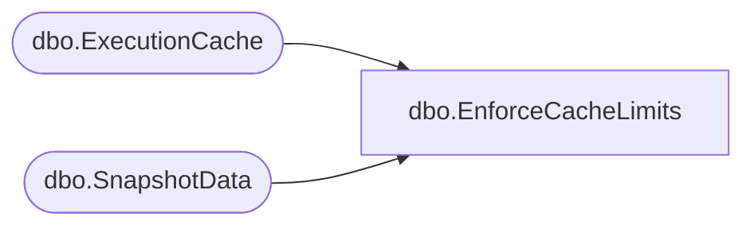

# dbo.EnforceCacheLimits

**Database:** ReportServerBIRPT02  
**Server:** bearcluster01  

## Architecture Diagram



## Table Dependencies

| Referenced Table |
|---|
| dbo.ExecutionCache |
| dbo.SnapshotData |

## Stored Procedure Code

```sql
CREATE PROC [dbo].[EnforceCacheLimits]
    @ItemID uniqueidentifier,
    @Cap int = 0
AS
BEGIN
    IF (@Cap > 0)
    BEGIN
        DECLARE @AffectedSnapshots TABLE (SnapshotDataID UNIQUEIDENTIFIER) ;
        DECLARE @Now DATETIME ;
        SELECT @Now = GETDATE() ;
        BEGIN TRANSACTION
            -- remove entries which are not in the top N based on the last used time
            -- don't count expired entries, don't purge them either (allow cleanup thread to handle expired entries)
            DELETE FROM [ReportServerBIRPT02TempDB].dbo.ExecutionCache
            OUTPUT DELETED.SnapshotDataID INTO @AffectedSnapshots(SnapshotDataID)
            WHERE	ExecutionCache.ReportID = @ItemID AND
                    ExecutionCache.AbsoluteExpiration > @Now AND
                    ExecutionCache.ExecutionCacheID NOT IN (
                        SELECT TOP (@Cap) EC.ExecutionCacheID
                        FROM [ReportServerBIRPT02TempDB].dbo.ExecutionCache EC
                        WHERE	EC.ReportID = @ItemID AND
                                EC.AbsoluteExpiration > @Now
                        ORDER BY EC.LastUsedTime DESC) ;

            UPDATE [ReportServerBIRPT02TempDB].dbo.SnapshotData
            SET PermanentRefCount = PermanentRefCount - 1
            WHERE SnapshotData.SnapshotDataID in (SELECT SnapshotDataID FROM @AffectedSnapshots) ;
        COMMIT
    END
END
```

