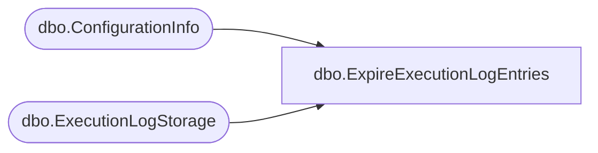

# dbo.ExpireExecutionLogEntries

**Database:** ReportServerBIRPT02  
**Server:** bearcluster01  

## Architecture Diagram



## Table Dependencies

| Referenced Table |
|---|
| dbo.ConfigurationInfo |
| dbo.ExecutionLogStorage |

## Stored Procedure Code

```sql
CREATE PROCEDURE [dbo].[ExpireExecutionLogEntries]
AS
SET NOCOUNT OFF
-- -1 means no expiration
if exists (select * from ConfigurationInfo where [Name] = 'ExecutionLogDaysKept' and CAST(CAST(Value as nvarchar) as integer) = -1)
begin
return
end

delete from ExecutionLogStorage
where DateDiff(day, TimeStart, getdate()) >= (select CAST(CAST(Value as nvarchar) as integer) from ConfigurationInfo where [Name] = 'ExecutionLogDaysKept')
```

