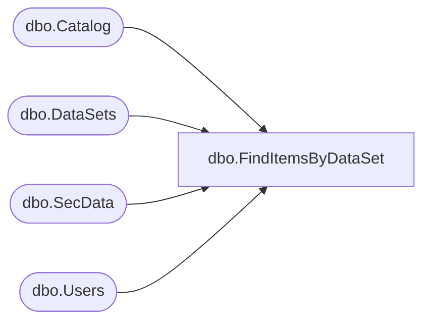

# dbo.FindItemsByDataSet

**Database:** ReportServerBIRPT02  
**Server:** bearcluster01  

## Architecture Diagram



## Table Dependencies

| Referenced Table |
|---|
| dbo.Catalog |
| dbo.DataSets |
| dbo.SecData |
| dbo.Users |

## Stored Procedure Code

```sql
CREATE PROCEDURE [dbo].[FindItemsByDataSet]
@ItemID uniqueidentifier,
@AuthType int,
@Type int = NULL
AS
SELECT
    C.Type,
    C.PolicyID,
    SD.NtSecDescPrimary,
    C.Name,
    C.Path,
    C.ItemID,
    DATALENGTH( C.Content ) AS [Size],
    C.Description,
    C.CreationDate,
    C.ModifiedDate,
    CU.UserName,
    CU.UserName,
    MU.UserName,
    MU.UserName,
    C.MimeType,
    C.ExecutionTime,
    C.Hidden,
    C.SubType,
    C.ComponentID
FROM
   Catalog AS C WITH (NOLOCK)
   INNER JOIN Users AS CU ON C.CreatedByID = CU.UserID
   INNER JOIN Users AS MU ON C.ModifiedByID = MU.UserID
   LEFT OUTER JOIN SecData AS SD ON C.PolicyID = SD.PolicyID AND SD.AuthType = @AuthType
   INNER JOIN DataSets AS DS ON C.ItemID = DS.ItemID
WHERE
   (@Type IS NULL OR @Type = C.Type)
   AND DS.LinkID = @ItemID
```

