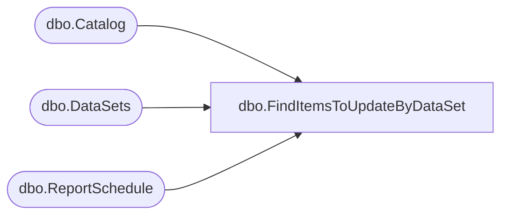

# dbo.FindItemsToUpdateByDataSet

**Database:** ReportServerBIRPT02  
**Server:** bearcluster01  

## Architecture Diagram



## Table Dependencies

| Referenced Table |
|---|
| dbo.Catalog |
| dbo.DataSets |
| dbo.ReportSchedule |

## Stored Procedure Code

```sql
CREATE PROCEDURE [dbo].[FindItemsToUpdateByDataSet]
@DataSetID uniqueidentifier
AS

select
        6, /* KpiDataUpdate enum. ToDo: Retrieve this from DB instead*/
        RS.[ScheduleID],
        DS.[ItemID],
        RS.[SubscriptionID],
        C.[Path],
        C.[Type]
from
    [DataSets] DS Inner join [Catalog] C on C.[ItemID] = DS.[ItemID]
    Inner join [ReportSchedule] RS on RS.[ReportID] = DS.[LinkID]
where
    DS.[LinkID] = @DataSetID
```

