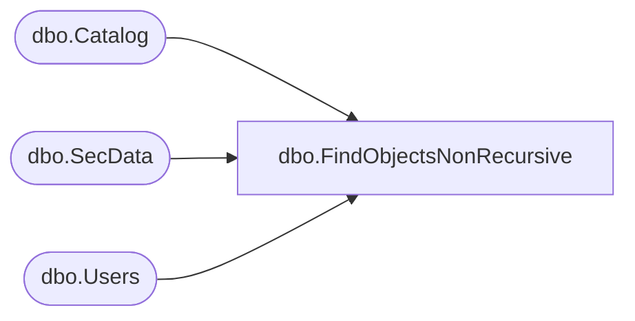

# dbo.FindObjectsNonRecursive

**Database:** ReportServerBIRPT02  
**Server:** bearcluster01  

## Architecture Diagram



## Table Dependencies

| Referenced Table |
|---|
| dbo.Catalog |
| dbo.SecData |
| dbo.Users |

## Stored Procedure Code

```sql
CREATE PROCEDURE [dbo].[FindObjectsNonRecursive]
@Path nvarchar (425),
@AuthType int
AS
SELECT
    C.Type,
    C.PolicyID,
    SD.NtSecDescPrimary,
    C.Name,
    C.Path,
    C.ItemID,
    DATALENGTH( C.Content ) AS [Size],
    C.Description,
    C.CreationDate,
    C.ModifiedDate,
    CU.[UserName],
    CU.[UserName],
    MU.[UserName],
    MU.[UserName],
    C.MimeType,
    C.ExecutionTime,
    C.Hidden,
    C.SubType,
    C.ComponentID
FROM
   Catalog AS C
   INNER JOIN Catalog AS P ON C.ParentID = P.ItemID
   INNER JOIN Users AS CU ON C.CreatedByID = CU.UserID
   INNER JOIN Users AS MU ON C.ModifiedByID = MU.UserID
   LEFT OUTER JOIN SecData SD ON C.PolicyID = SD.PolicyID AND SD.AuthType = @AuthType
WHERE P.Path = @Path
   AND C.Path <> '/68f0607b-9378-4bbb-9e70-4da3d7d66838' -- hide System Resources from output
```

