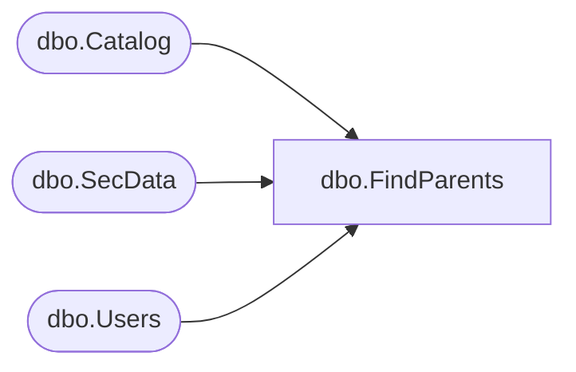

# dbo.FindParents

**Database:** ReportServerBIRPT02  
**Server:** bearcluster01  

## Architecture Diagram



## Table Dependencies

| Referenced Table |
|---|
| dbo.Catalog |
| dbo.SecData |
| dbo.Users |

## Stored Procedure Code

```sql
CREATE PROCEDURE [dbo].[FindParents]
@Path nvarchar (425),
@AuthType int
AS
WITH Parents (ItemID, ParentID)
AS
(
    SELECT ItemID, ParentID
    FROM Catalog WHERE Path = @Path
    UNION ALL
    SELECT C.ItemID, C.ParentID
    FROM Catalog C
    JOIN Parents P ON (C.ItemID = P.ParentID)
)
SELECT
    C.Type,
    C.PolicyID,
    SD.NtSecDescPrimary,
    C.Name,
    C.Path,
    C.ItemID,
    DATALENGTH( C.Content ) AS [Size],
    C.Description,
    C.CreationDate,
    C.ModifiedDate,
    CU.[UserName],
    CU.[UserName],
    MU.[UserName],
    MU.[UserName],
    C.MimeType,
    C.ExecutionTime,
    C.Hidden,
    C.SubType,
    C.ComponentID
FROM
   Catalog AS C
   INNER JOIN Parents P ON (C.ItemID = P.ItemID)
   INNER JOIN Users AS CU ON C.CreatedByID = CU.UserID
   INNER JOIN Users AS MU ON C.ModifiedByID = MU.UserID
   LEFT OUTER JOIN SecData SD ON C.PolicyID = SD.PolicyID AND SD.AuthType = @AuthType
WHERE C.Path <> @Path -- Exclude the target item from the output list
ORDER BY DATALENGTH(C.Path) DESC
```

