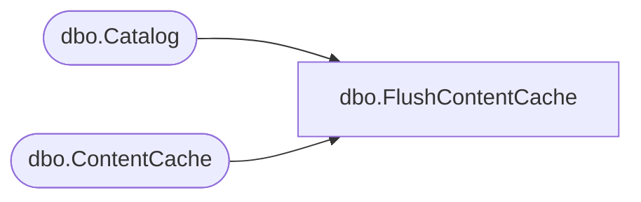

# dbo.FlushContentCache

**Database:** ReportServerBIRPT02  
**Server:** bearcluster01  

## Architecture Diagram



## Table Dependencies

| Referenced Table |
|---|
| dbo.Catalog |
| dbo.ContentCache |

## Stored Procedure Code

```sql
CREATE PROCEDURE [dbo].[FlushContentCache]
    @Path as nvarchar(425)
AS
    SET DEADLOCK_PRIORITY LOW
    SET NOCOUNT ON
    DECLARE @CatalogItemID AS UNIQUEIDENTIFIER

    SELECT @CatalogItemID=ItemID FROM [dbo].[Catalog] WHERE [Path]=@Path

    DELETE
    FROM
       [ReportServerBIRPT02TempDB].dbo.[ContentCache]
    WHERE
       CatalogItemID = @CatalogItemID

    SELECT @@ROWCOUNT
```

