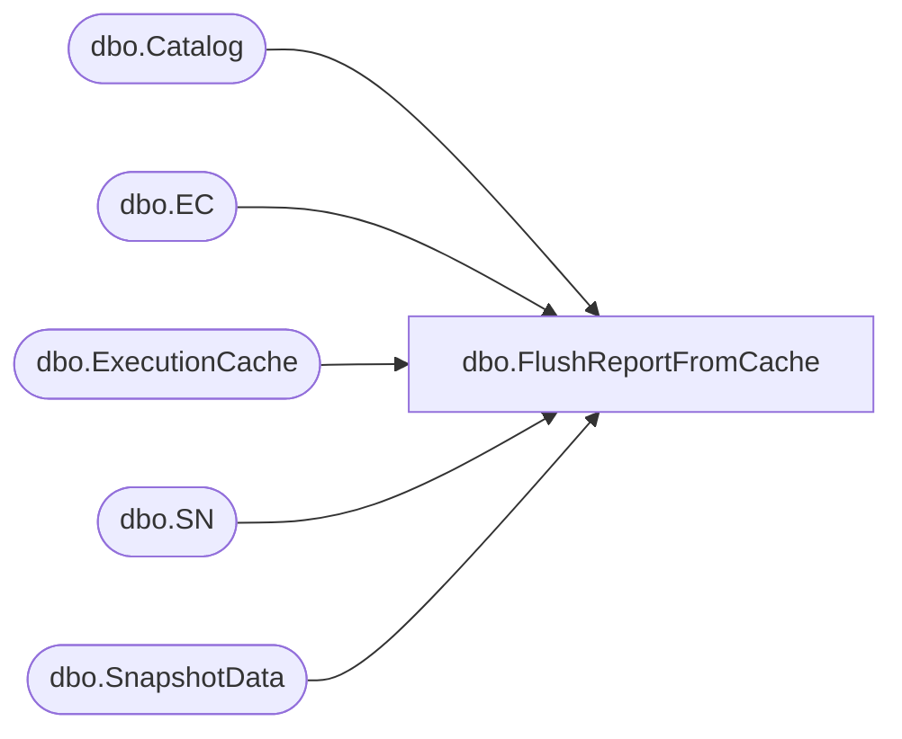

# dbo.FlushReportFromCache

**Database:** ReportServerBIRPT02  
**Server:** bearcluster01  

## Architecture Diagram



## Table Dependencies

| Referenced Table |
|---|
| dbo.Catalog |
| dbo.EC |
| dbo.ExecutionCache |
| dbo.SN |
| dbo.SnapshotData |

## Stored Procedure Code

```sql
CREATE PROCEDURE [dbo].[FlushReportFromCache]
@Path as nvarchar(425)
AS

SET DEADLOCK_PRIORITY LOW

-- VSTS #139360: SQL Deadlock in GetReportForexecution stored procedure
-- Use temporary table to keep the same order of accessing the ExecutionCache
-- and SnapshotData tables as GetReportForExecution does, that is first
-- delete from the ExecutionCache, then update the SnapshotData
CREATE TABLE #tempSnapshot (SnapshotDataID uniqueidentifier)
INSERT INTO #tempSnapshot SELECT SN.SnapshotDataID
FROM
   [ReportServerBIRPT02TempDB].dbo.SnapshotData AS SN WITH (UPDLOCK)
   INNER JOIN [ReportServerBIRPT02TempDB].dbo.ExecutionCache AS EC WITH (UPDLOCK) ON SN.SnapshotDataID = EC.SnapshotDataID
   INNER JOIN Catalog AS C ON EC.ReportID = C.ItemID
WHERE C.Path = @Path

DELETE EC
FROM
   [ReportServerBIRPT02TempDB].dbo.ExecutionCache AS EC
   INNER JOIN #tempSnapshot ON #tempSnapshot.SnapshotDataID = EC.SnapshotDataID

UPDATE SN
   SET SN.PermanentRefcount = SN.PermanentRefcount - 1
FROM
   [ReportServerBIRPT02TempDB].dbo.SnapshotData AS SN
   INNER JOIN #tempSnapshot ON #tempSnapshot.SnapshotDataID = SN.SnapshotDataID
```

