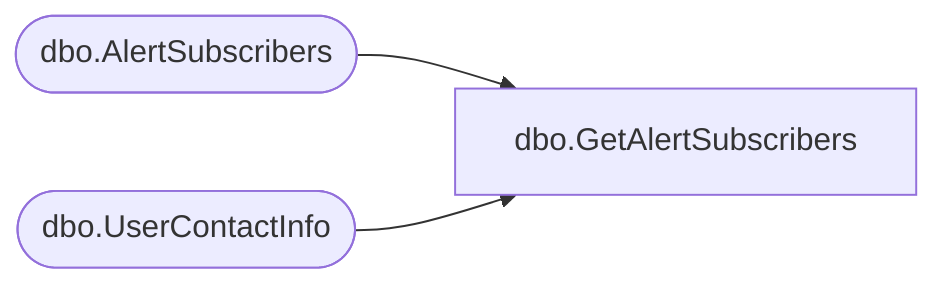

# dbo.GetAlertSubscribers

**Database:** ReportServerBIRPT02  
**Server:** bearcluster01  

## Architecture Diagram



## Table Dependencies

| Referenced Table |
|---|
| dbo.AlertSubscribers |
| dbo.UserContactInfo |

## Stored Procedure Code

```sql
CREATE PROCEDURE [dbo].[GetAlertSubscribers]
    @ItemID uniqueidentifier,
    @AlertType nvarchar(50)
AS
BEGIN
    SELECT
        U.[DefaultEmailAddress]
    FROM
        [AlertSubscribers] as A
        INNER JOIN UserContactInfo as U ON A.[UserID] = U.[UserID]
    WHERE
        A.[ItemID] = @ItemID
        AND
        A.[AlertType] = @AlertType
END
```

