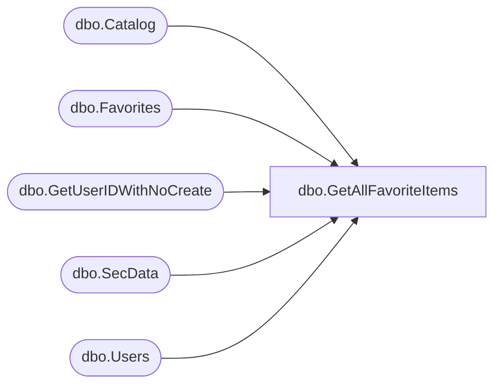

# dbo.GetAllFavoriteItems

**Database:** ReportServerBIRPT02  
**Server:** bearcluster01  

## Architecture Diagram



## Table Dependencies

| Referenced Table |
|---|
| dbo.Catalog |
| dbo.Favorites |
| dbo.GetUserIDWithNoCreate |
| dbo.SecData |
| dbo.Users |

## Stored Procedure Code

```sql
CREATE PROCEDURE [dbo].[GetAllFavoriteItems]
@UserName nvarchar (425),
@UserSid varbinary(85) = NULL,
@AuthType int
AS

DECLARE @UserID uniqueidentifier
EXEC GetUserIDWithNoCreate @UserSid, @UserName, @AuthType, @UserID OUTPUT

SET NOCOUNT ON;

SELECT
    C.Type,
    C.PolicyID,
    SD.NtSecDescPrimary,
    C.Name,
    C.Path,
    C.ItemID,
    DATALENGTH( C.Content ) AS [Size],
    C.Description,
    C.CreationDate,
    C.ModifiedDate,
    CU.[UserName],
    CU.[UserName],
    MU.[UserName],
    MU.[UserName],
    C.MimeType,
    C.ExecutionTime,
    C.Hidden,
    C.SubType,
    C.ComponentID,
    CAST(1 AS bit)
FROM
   Catalog AS C
   INNER JOIN [dbo].[Catalog] AS P ON C.ParentID = P.ItemID
   INNER JOIN [dbo].[Users] AS CU ON C.CreatedByID = CU.UserID
   INNER JOIN [dbo].[Users] AS MU ON C.ModifiedByID = MU.UserID
   INNER JOIN [dbo].[Favorites] F ON C.ItemID = F.ItemID AND F.UserID = @UserID
   LEFT OUTER JOIN [dbo].[SecData] SD ON C.PolicyID = SD.PolicyID AND SD.AuthType = @AuthType
```

