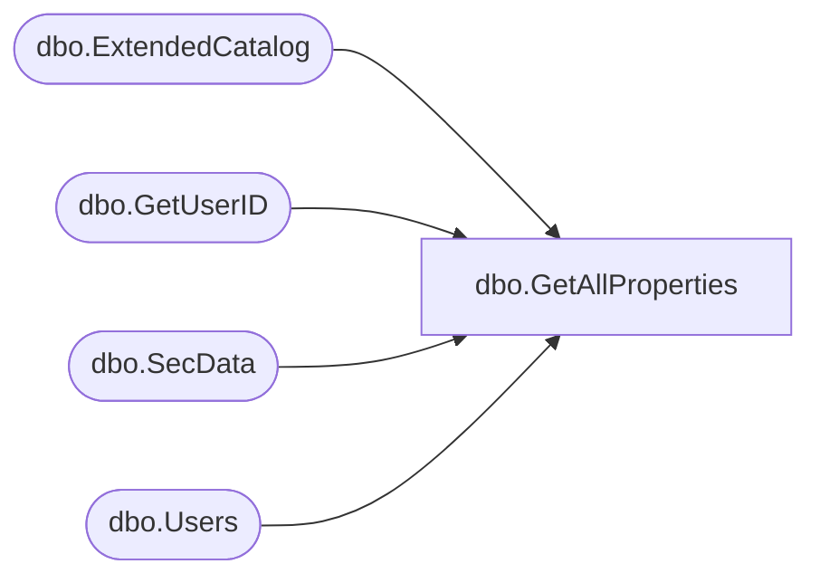

# dbo.GetAllProperties

**Database:** ReportServerBIRPT02  
**Server:** bearcluster01  

## Architecture Diagram



## Table Dependencies

| Referenced Table |
|---|
| dbo.ExtendedCatalog |
| dbo.GetUserID |
| dbo.SecData |
| dbo.Users |

## Stored Procedure Code

```sql
CREATE PROCEDURE [dbo].[GetAllProperties]
@Path nvarchar (425),
@EditSessionID varchar(32) = NULL,
@OwnerSid as varbinary(85) = NULL,
@OwnerName as nvarchar(260) = NULL,
@AuthType int
AS
BEGIN

DECLARE @OwnerID uniqueidentifier
if(@EditSessionID is not null)
BEGIN
    EXEC GetUserID @OwnerSid, @OwnerName, @AuthType, @OwnerID OUTPUT
END

select
   Property,
   Description,
   Type,
   DATALENGTH( Content ),
   ItemID,
   C.UserName,
   C.UserName,
   CreationDate,
   M.UserName,
   M.UserName,
   Catalog.ModifiedDate,
   MimeType,
   ExecutionTime,
   NtSecDescPrimary,
   [LinkSourceID],
   Hidden,
   ExecutionFlag,
   SnapshotLimit,
   [Name],
   SubType,
   ComponentID
FROM ExtendedCatalog(@OwnerID, @Path, @EditSessionID) Catalog
   INNER JOIN Users C ON Catalog.CreatedByID = C.UserID
   INNER JOIN Users M ON Catalog.ModifiedByID = M.UserID
   LEFT OUTER JOIN SecData ON Catalog.PolicyID = SecData.PolicyID AND SecData.AuthType = @AuthType
END
```

