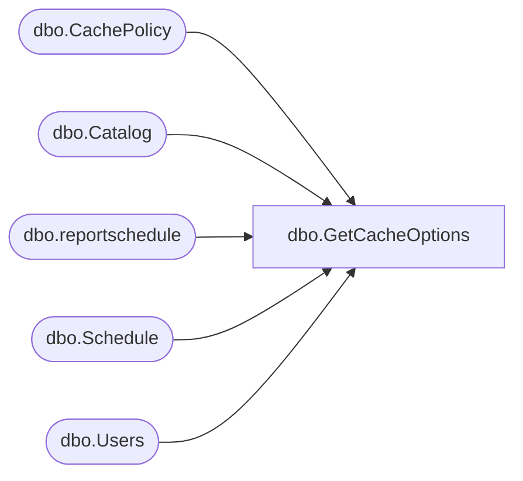

# dbo.GetCacheOptions

**Database:** ReportServerBIRPT02  
**Server:** bearcluster01  

## Architecture Diagram



## Table Dependencies

| Referenced Table |
|---|
| dbo.CachePolicy |
| dbo.Catalog |
| dbo.reportschedule |
| dbo.Schedule |
| dbo.Users |

## Stored Procedure Code

```sql
CREATE PROCEDURE [dbo].[GetCacheOptions]
@Path as nvarchar(425)
AS
    SELECT ExpirationFlags, CacheExpiration,
    S.[ScheduleID],
    S.[Name],
    S.[StartDate],
    S.[Flags],
    S.[NextRunTime],
    S.[LastRunTime],
    S.[EndDate],
    S.[RecurrenceType],
    S.[MinutesInterval],
    S.[DaysInterval],
    S.[WeeksInterval],
    S.[DaysOfWeek],
    S.[DaysOfMonth],
    S.[Month],
    S.[MonthlyWeek],
    S.[State],
    S.[LastRunStatus],
    S.[ScheduledRunTimeout],
    S.[EventType],
    S.[EventData],
    S.[Type],
    S.[Path]
    FROM CachePolicy INNER JOIN Catalog ON Catalog.ItemID = CachePolicy.ReportID
    LEFT outer join reportschedule rs on catalog.itemid = rs.reportid and rs.reportaction = 3
    LEFT OUTER JOIN [Schedule] S ON S.ScheduleID = rs.ScheduleID
    LEFT OUTER JOIN [Users] Owner on Owner.UserID = S.[CreatedById]
    WHERE Catalog.Path = @Path
```

