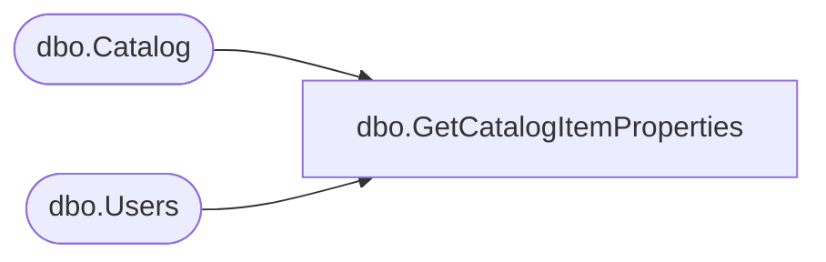

# dbo.GetCatalogItemProperties

**Database:** ReportServerBIRPT02  
**Server:** bearcluster01  

## Architecture Diagram



## Table Dependencies

| Referenced Table |
|---|
| dbo.Catalog |
| dbo.Users |

## Stored Procedure Code

```sql
CREATE PROCEDURE [dbo].[GetCatalogItemProperties]
@CatalogItemID AS uniqueidentifier
AS

SELECT
   [ItemID] AS [ItemId],
   [Path],
   [Name],
   [Type],
   DATALENGTH(Content) AS [SizeInBytes],
   C.[UserName] AS [CreatorUserName],
   [CreationDate],
   M.[UserName] AS [ModifierUserName],
   [Catalog].[ModifiedDate],
   [MimeType],
   [Hidden]
FROM
    [Catalog]
    INNER JOIN Users C ON [Catalog].CreatedByID = C.UserID
    INNER JOIN Users M ON [Catalog].ModifiedByID = M.UserID
WHERE
    [ItemID] = @CatalogItemID
```

