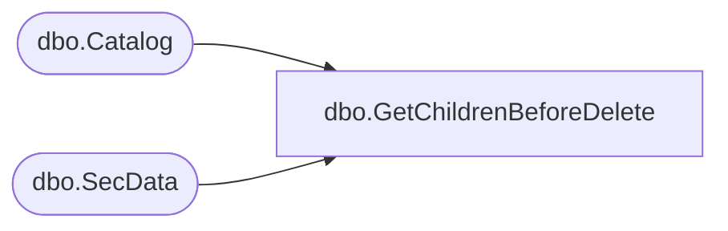

# dbo.GetChildrenBeforeDelete

**Database:** ReportServerBIRPT02  
**Server:** bearcluster01  

## Architecture Diagram



## Table Dependencies

| Referenced Table |
|---|
| dbo.Catalog |
| dbo.SecData |

## Stored Procedure Code

```sql
CREATE PROCEDURE [dbo].[GetChildrenBeforeDelete]
@Prefix nvarchar (850),
@AuthType int
AS
SELECT C.PolicyID, C.Type, SD.NtSecDescPrimary
FROM
   Catalog AS C LEFT OUTER JOIN SecData AS SD ON C.PolicyID = SD.PolicyID AND SD.AuthType = @AuthType
WHERE
   C.Path LIKE @Prefix ESCAPE '*'  -- return children only, not item itself
   AND C.SubType <> 'MobileReportChild' -- Ignore resources from mobile reports
```

