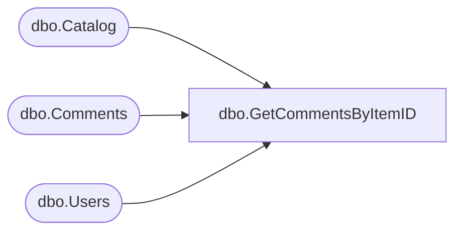

# dbo.GetCommentsByItemID

**Database:** ReportServerBIRPT02  
**Server:** bearcluster01  

## Architecture Diagram



## Table Dependencies

| Referenced Table |
|---|
| dbo.Catalog |
| dbo.Comments |
| dbo.Users |

## Stored Procedure Code

```sql
CREATE PROCEDURE [dbo].[GetCommentsByItemID]
@ItemID uniqueidentifier
AS
BEGIN
    SELECT
        C.[CommentID],
        C.[ItemID],
        U.[UserName],
        C.[ThreadID],
        C.[Text],
        C.[CreatedDate],
        C.[ModifiedDate],
        CA.[Path] AS AttachmentPath
    FROM
        [Comments] as C
        INNER JOIN Users as U ON C.[UserID] = U.[UserID]
        LEFT JOIN Catalog as CA ON C.[AttachmentID] = CA.[ItemID]
    WHERE
        C.[ItemID] = @ItemID
END
```

