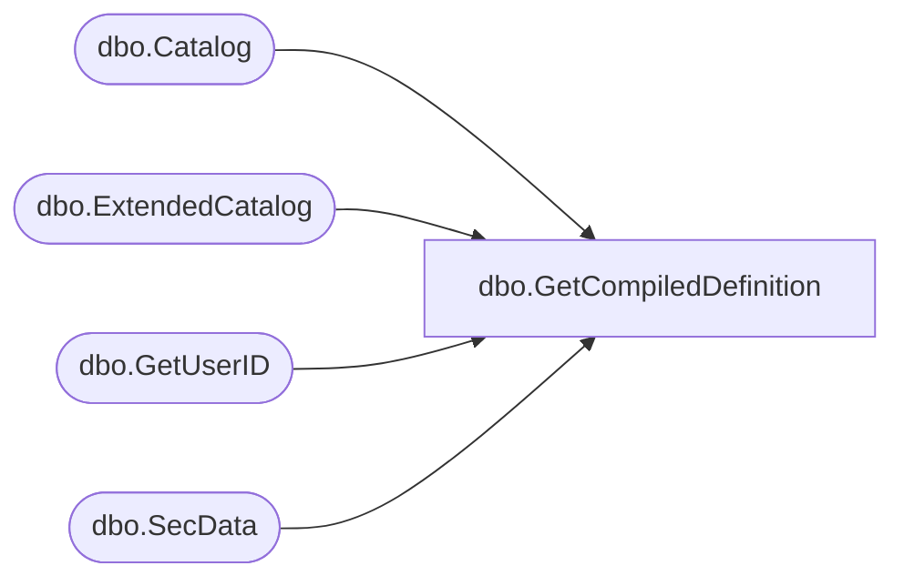

# dbo.GetCompiledDefinition

**Database:** ReportServerBIRPT02  
**Server:** bearcluster01  

## Architecture Diagram



## Table Dependencies

| Referenced Table |
|---|
| dbo.Catalog |
| dbo.ExtendedCatalog |
| dbo.GetUserID |
| dbo.SecData |

## Stored Procedure Code

```sql
-- used to create snapshots
CREATE PROCEDURE [dbo].[GetCompiledDefinition]
@Path nvarchar (425),
@EditSessionID varchar(32) = NULL,
@OwnerSid as varbinary(85) = NULL,
@OwnerName as nvarchar(260) = NULL,
@AuthType int
AS
BEGIN

DECLARE @OwnerID uniqueidentifier
if(@EditSessionID is not null)
BEGIN
    EXEC GetUserID @OwnerSid, @OwnerName, @AuthType, @OwnerID OUTPUT
END

    SELECT
       MainItem.Type,
       MainItem.Intermediate,
       MainItem.LinkSourceID,
       MainItem.Property,
       MainItem.Description,
       SecData.NtSecDescPrimary,
       MainItem.ItemID,
       MainItem.ExecutionFlag,
       LinkTarget.Intermediate,
       LinkTarget.Property,
       LinkTarget.Description,
       MainItem.[SnapshotDataID],
       MainItem.IntermediateIsPermanent
    FROM ExtendedCatalog(@OwnerID, @Path, @EditSessionID) MainItem
    LEFT OUTER JOIN SecData ON MainItem.PolicyID = SecData.PolicyID AND SecData.AuthType = @AuthType
    LEFT OUTER JOIN Catalog LinkTarget with (INDEX(PK_Catalog)) on MainItem.LinkSourceID = LinkTarget.ItemID
END
```

