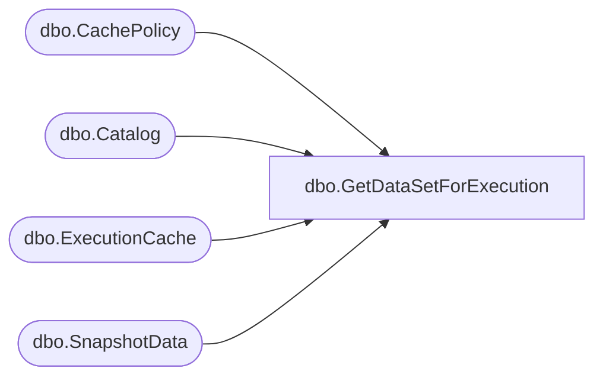

# dbo.GetDataSetForExecution

**Database:** ReportServerBIRPT02  
**Server:** bearcluster01  

## Architecture Diagram



## Table Dependencies

| Referenced Table |
|---|
| dbo.CachePolicy |
| dbo.Catalog |
| dbo.ExecutionCache |
| dbo.SnapshotData |

## Stored Procedure Code

```sql
CREATE PROCEDURE [dbo].[GetDataSetForExecution]
@ItemID uniqueidentifier,
@ParamsHash int
AS
DECLARE @now AS datetime
SET @now = GETDATE()
SELECT
    SN.SnapshotDataID,
    SN.EffectiveParams,
    SN.QueryParams,
    (SELECT CachePolicy.ExpirationFlags FROM CachePolicy WHERE CachePolicy.ReportID = Cat.ItemID),
    Cat.Property
FROM
    Catalog AS Cat
    LEFT OUTER JOIN
    (
        SELECT
        TOP 1
            ReportID,
            SN.SnapshotDataID,
            EffectiveParams,
            QueryParams
        FROM [ReportServerBIRPT02TempDB].dbo.ExecutionCache AS EC
        INNER JOIN [ReportServerBIRPT02TempDB].dbo.SnapshotData AS SN ON EC.SnapshotDataID = SN.SnapshotDataID AND EC.ParamsHash = SN.ParamsHash
        WHERE
            AbsoluteExpiration > @now
            AND SN.ParamsHash = @ParamsHash
            AND EC.ReportID = @ItemID
        ORDER BY SN.CreatedDate DESC
    ) as SN ON Cat.ItemID = SN.ReportID
WHERE
    Cat.ItemID = @ItemID
```

