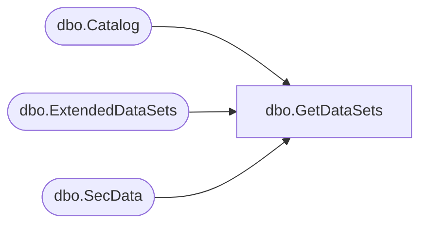

# dbo.GetDataSets

**Database:** ReportServerBIRPT02  
**Server:** bearcluster01  

## Architecture Diagram



## Table Dependencies

| Referenced Table |
|---|
| dbo.Catalog |
| dbo.ExtendedDataSets |
| dbo.SecData |

## Stored Procedure Code

```sql
CREATE  PROCEDURE [dbo].[GetDataSets]
@ItemID [uniqueidentifier],
@AuthType int
AS
BEGIN

SELECT
    DS.ID,
    DS.LinkID,
    DS.[Name],
    C.Path,
    SD.NtSecDescPrimary,
    C.Intermediate,
    C.[Parameter]
FROM
   ExtendedDataSets AS DS
   LEFT OUTER JOIN Catalog C ON DS.[LinkID] = C.[ItemID]
   LEFT OUTER JOIN [SecData] AS SD ON C.[PolicyID] = SD.[PolicyID] AND SD.AuthType = @AuthType
WHERE
   DS.[ItemID] = @ItemID
END
```

