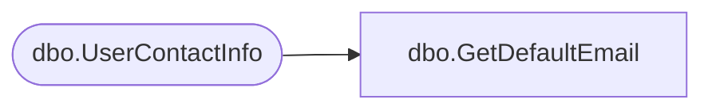

# dbo.GetDefaultEmail

**Database:** ReportServerBIRPT02  
**Server:** bearcluster01  

## Architecture Diagram



## Table Dependencies

| Referenced Table |
|---|
| dbo.UserContactInfo |

## Stored Procedure Code

```sql
CREATE PROCEDURE [dbo].[GetDefaultEmail]
    @UserID uniqueidentifier
AS
BEGIN
    SELECT TOP(1)
        U.[DefaultEmailAddress]
    FROM
        [UserContactInfo] as U
    WHERE
        U.UserID = @UserID
END
```

