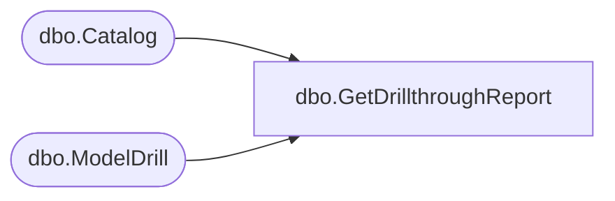

# dbo.GetDrillthroughReport

**Database:** ReportServerBIRPT02  
**Server:** bearcluster01  

## Architecture Diagram



## Table Dependencies

| Referenced Table |
|---|
| dbo.Catalog |
| dbo.ModelDrill |

## Stored Procedure Code

```sql
CREATE PROCEDURE [dbo].[GetDrillthroughReport]
@ModelPath nvarchar(425),
@ModelItemID nvarchar(425),
@Type tinyint
AS
 SELECT
 CatRep.Path
 FROM ModelDrill
 INNER JOIN Catalog CatMod ON ModelDrill.ModelID = CatMod.ItemID
 INNER JOIN Catalog CatRep ON ModelDrill.ReportID = CatRep.ItemID
 WHERE CatMod.Path = @ModelPath
 AND ModelItemID = @ModelItemID
 AND ModelDrill.[Type] = @Type
```

