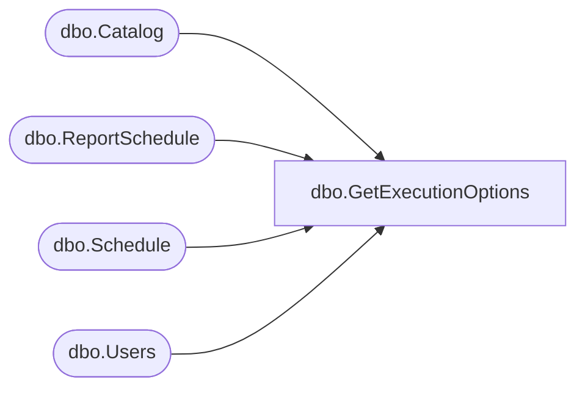

# dbo.GetExecutionOptions

**Database:** ReportServerBIRPT02  
**Server:** bearcluster01  

## Architecture Diagram



## Table Dependencies

| Referenced Table |
|---|
| dbo.Catalog |
| dbo.ReportSchedule |
| dbo.Schedule |
| dbo.Users |

## Stored Procedure Code

```sql
CREATE PROCEDURE [dbo].[GetExecutionOptions]
@Path nvarchar(425)
AS
    SELECT ExecutionFlag,
    S.[ScheduleID],
    S.[Name],
    S.[StartDate],
    S.[Flags],
    S.[NextRunTime],
    S.[LastRunTime],
    S.[EndDate],
    S.[RecurrenceType],
    S.[MinutesInterval],
    S.[DaysInterval],
    S.[WeeksInterval],
    S.[DaysOfWeek],
    S.[DaysOfMonth],
    S.[Month],
    S.[MonthlyWeek],
    S.[State],
    S.[LastRunStatus],
    S.[ScheduledRunTimeout],
    S.[EventType],
    S.[EventData],
    S.[Type],
    S.[Path]
    FROM Catalog
    LEFT OUTER JOIN ReportSchedule ON Catalog.ItemID = ReportSchedule.ReportID AND ReportSchedule.ReportAction = 1
    LEFT OUTER JOIN [Schedule] S ON S.ScheduleID = ReportSchedule.ScheduleID
    LEFT OUTER JOIN [Users] Owner on Owner.UserID = S.[CreatedById]
    WHERE Catalog.Path = @Path
```

