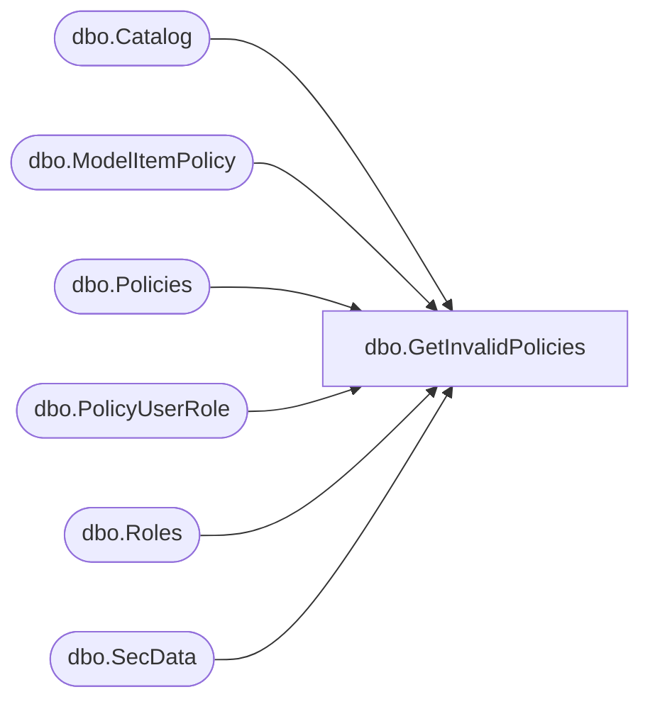

# dbo.GetInvalidPolicies

**Database:** ReportServerBIRPT02  
**Server:** bearcluster01  

## Architecture Diagram



## Table Dependencies

| Referenced Table |
|---|
| dbo.Catalog |
| dbo.ModelItemPolicy |
| dbo.Policies |
| dbo.PolicyUserRole |
| dbo.Roles |
| dbo.SecData |

## Stored Procedure Code

```sql
CREATE PROCEDURE [dbo].[GetInvalidPolicies]
    @TopCount int,
    @AuthType int
AS
BEGIN
    SELECT
        PolicyRoles.PolicyID,
        TopDirtyPolicies.XmlDescription,
        PolicyRoles.PolicyFlag,
        Catalog.Type,
        Catalog.Path,
        ModelItemPolicy.CatalogItemID,
        ModelItemPolicy.ModelItemID,
        PolicyRoles.RoleID,
        PolicyRoles.RoleName,
        PolicyRoles.TaskMask,
        PolicyRoles.RoleFlags
    FROM
        (SELECT TOP (@TopCount)
            PolicyId,
            XmlDescription
        FROM
            SecData
        WHERE SecData.NtSecDescState = 1 AND SecData.AuthType = @AuthType) TopDirtyPolicies

        INNER JOIN

        (SELECT
            DISTINCT
            PolicyUserRole.PolicyID,
            Roles.RoleID,
            Roles.RoleName,
            Roles.TaskMask,
            Roles.RoleFlags,
            Policies.PolicyFlag
        FROM
            PolicyUserRole
            INNER JOIN Roles ON PolicyUserRole.RoleID = Roles.RoleID
            INNER JOIN Policies ON PolicyUserRole.PolicyID = Policies.PolicyID
        ) PolicyRoles
        ON PolicyRoles.PolicyId = TopDirtyPolicies.PolicyID
        LEFT OUTER JOIN Catalog ON PolicyRoles.PolicyID = Catalog.PolicyID AND Catalog.PolicyRoot = 1
        LEFT OUTER JOIN ModelItemPolicy ON PolicyRoles.PolicyID = ModelItemPolicy.PolicyID
    ORDER BY PolicyRoles.PolicyID
END
```

