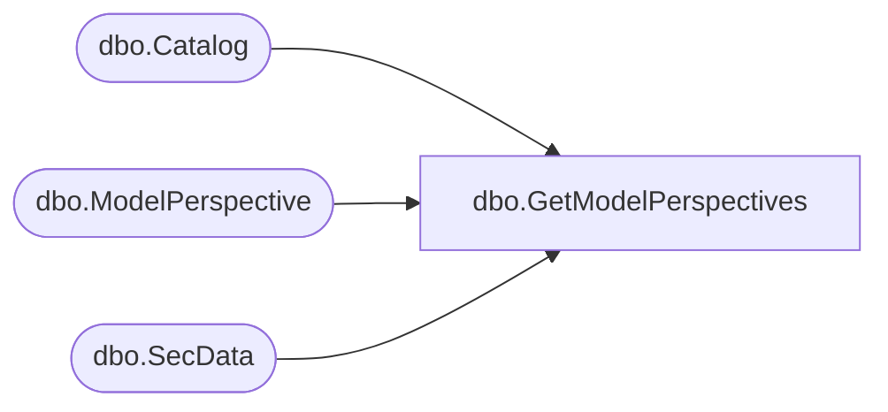

# dbo.GetModelPerspectives

**Database:** ReportServerBIRPT02  
**Server:** bearcluster01  

## Architecture Diagram



## Table Dependencies

| Referenced Table |
|---|
| dbo.Catalog |
| dbo.ModelPerspective |
| dbo.SecData |

## Stored Procedure Code

```sql
CREATE PROCEDURE [dbo].[GetModelPerspectives]
@Path nvarchar (425),
@AuthType int
AS

SELECT
    C.[Type],
    SD.[NtSecDescPrimary],
    C.[Description]
FROM
    [Catalog] as C
    LEFT OUTER JOIN [SecData] AS SD ON C.[PolicyID] = SD.[PolicyID] AND SD.[AuthType] = @AuthType
WHERE
    [Path] = @Path

SELECT
    P.[PerspectiveID],
    P.[PerspectiveName],
    P.[PerspectiveDescription]
FROM
    [Catalog] as C
    INNER JOIN [ModelPerspective] as P ON C.[ItemID] = P.[ModelID]
WHERE
    [Path] = @Path
```

