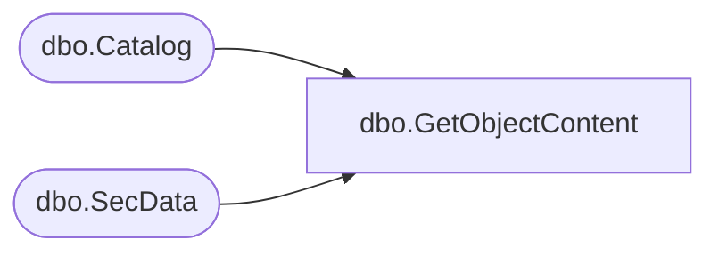

# dbo.GetObjectContent

**Database:** ReportServerBIRPT02  
**Server:** bearcluster01  

## Architecture Diagram



## Table Dependencies

| Referenced Table |
|---|
| dbo.Catalog |
| dbo.SecData |

## Stored Procedure Code

```sql
CREATE PROCEDURE [dbo].[GetObjectContent]
@Path nvarchar (425),
@AuthType int
AS
SELECT Type, Content, LinkSourceID, MimeType, SecData.NtSecDescPrimary, ItemID
FROM Catalog
LEFT OUTER JOIN SecData ON Catalog.PolicyID = SecData.PolicyID AND SecData.AuthType = @AuthType
WHERE Path = @Path
```

