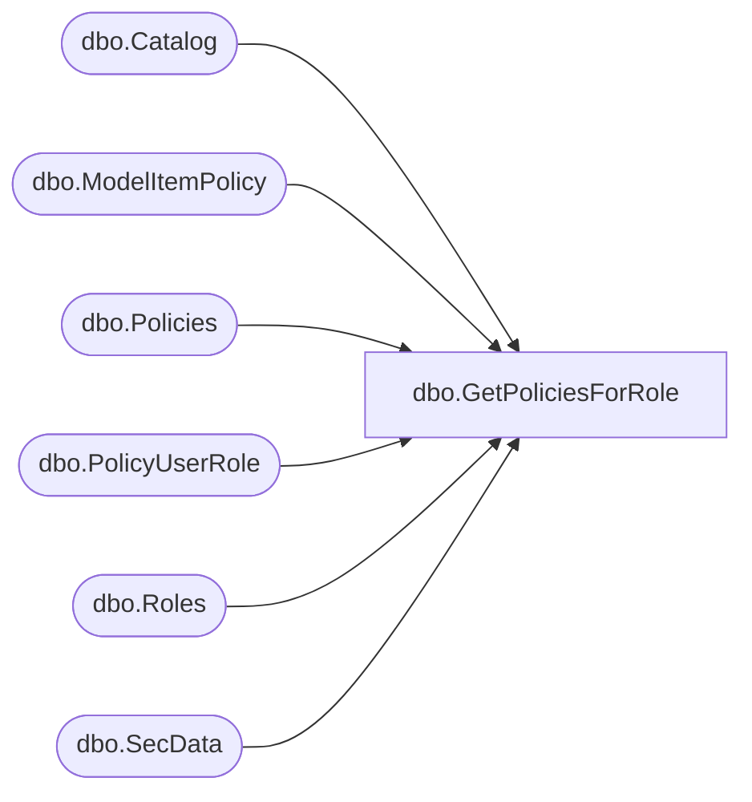

# dbo.GetPoliciesForRole

**Database:** ReportServerBIRPT02  
**Server:** bearcluster01  

## Architecture Diagram



## Table Dependencies

| Referenced Table |
|---|
| dbo.Catalog |
| dbo.ModelItemPolicy |
| dbo.Policies |
| dbo.PolicyUserRole |
| dbo.Roles |
| dbo.SecData |

## Stored Procedure Code

```sql
CREATE PROCEDURE [dbo].[GetPoliciesForRole]
@RoleName as nvarchar(260),
@AuthType as int
AS
SELECT
    Policies.PolicyID,
    SecData.XmlDescription,
    Policies.PolicyFlag,
    Catalog.Type,
    Catalog.Path,
    ModelItemPolicy.CatalogItemID,
    ModelItemPolicy.ModelItemID,
    RelatedRoles.RoleID,
    RelatedRoles.RoleName,
    RelatedRoles.TaskMask,
    RelatedRoles.RoleFlags
FROM
    Roles
    INNER JOIN PolicyUserRole ON Roles.RoleID = PolicyUserRole.RoleID
    INNER JOIN Policies ON PolicyUserRole.PolicyID = Policies.PolicyID
    INNER JOIN PolicyUserRole AS RelatedPolicyUserRole ON Policies.PolicyID = RelatedPolicyUserRole.PolicyID
    INNER JOIN Roles AS RelatedRoles ON RelatedPolicyUserRole.RoleID = RelatedRoles.RoleID
    LEFT OUTER JOIN SecData ON Policies.PolicyID = SecData.PolicyID AND SecData.AuthType = @AuthType
    LEFT OUTER JOIN Catalog ON Policies.PolicyID = Catalog.PolicyID AND Catalog.PolicyRoot = 1
    LEFT OUTER JOIN ModelItemPolicy ON Policies.PolicyID = ModelItemPolicy.PolicyID
WHERE
    Roles.RoleName = @RoleName
ORDER BY
    Policies.PolicyID
```

