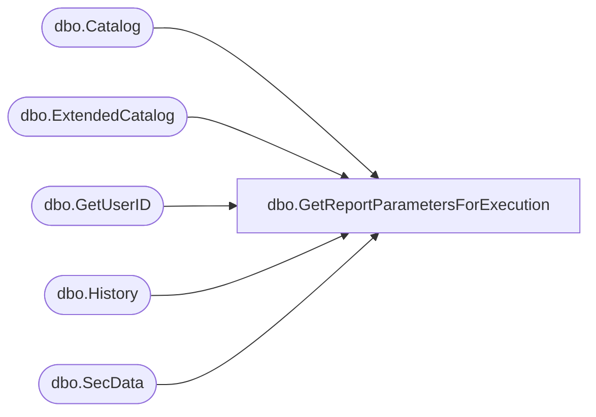

# dbo.GetReportParametersForExecution

**Database:** ReportServerBIRPT02  
**Server:** bearcluster01  

## Architecture Diagram



## Table Dependencies

| Referenced Table |
|---|
| dbo.Catalog |
| dbo.ExtendedCatalog |
| dbo.GetUserID |
| dbo.History |
| dbo.SecData |

## Stored Procedure Code

```sql
-- gets either the intermediate format or snapshot from cache
CREATE PROCEDURE [dbo].[GetReportParametersForExecution]
@Path nvarchar (425),
@HistoryID DateTime = NULL,
@AuthType int,
@OwnerSid as varbinary(85) = NULL,
@OwnerName as nvarchar(260) = NULL,
@EditSessionID varchar(32) = NULL
AS
BEGIN

DECLARE @OwnerID uniqueidentifier
if(@EditSessionID is not null)
BEGIN
    EXEC GetUserID @OwnerSid, @OwnerName, @AuthType, @OwnerID OUTPUT
END

SELECT
   C.[ItemID],
   C.[Type],
   C.[ExecutionFlag],
   [SecData].[NtSecDescPrimary],
   C.[Parameter],
   C.[Intermediate],
   C.[SnapshotDataID],
   [History].[SnapshotDataID],
   L.[Intermediate],
   C.[LinkSourceID],
   C.[ExecutionTime],
   C.IntermediateIsPermanent
FROM
   ExtendedCatalog(@OwnerID, @Path, @EditSessionID) AS C
   LEFT OUTER JOIN [SecData] ON C.[PolicyID] = [SecData].[PolicyID] AND [SecData].AuthType = @AuthType
   LEFT OUTER JOIN [History] ON ( C.[ItemID] = [History].[ReportID] AND [History].[SnapshotDate] = @HistoryID )
   LEFT OUTER JOIN [Catalog] AS L WITH (INDEX(PK_Catalog)) ON C.[LinkSourceID] = L.[ItemID]
end
```

