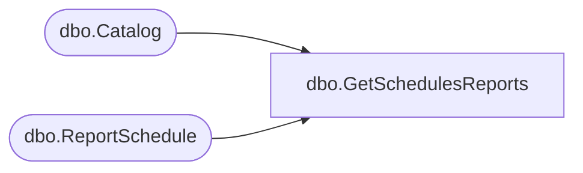

# dbo.GetSchedulesReports

**Database:** ReportServerBIRPT02  
**Server:** bearcluster01  

## Architecture Diagram



## Table Dependencies

| Referenced Table |
|---|
| dbo.Catalog |
| dbo.ReportSchedule |

## Stored Procedure Code

```sql
CREATE PROCEDURE [dbo].[GetSchedulesReports]
@ID uniqueidentifier
AS

select
    C.Path
from
    ReportSchedule RS inner join Catalog C on (C.ItemID = RS.ReportID)
where
    ScheduleID = @ID
```

