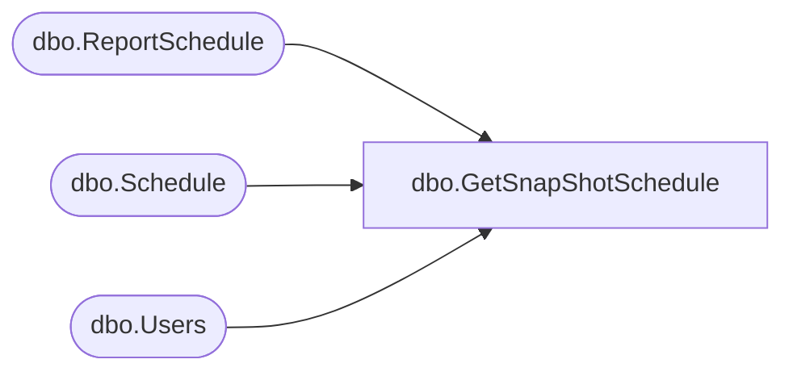

# dbo.GetSnapShotSchedule

**Database:** ReportServerBIRPT02  
**Server:** bearcluster01  

## Architecture Diagram



## Table Dependencies

| Referenced Table |
|---|
| dbo.ReportSchedule |
| dbo.Schedule |
| dbo.Users |

## Stored Procedure Code

```sql
CREATE PROCEDURE [dbo].[GetSnapShotSchedule]
@ReportID uniqueidentifier
AS

select
    S.[ScheduleID],
    S.[Name],
    S.[StartDate],
    S.[Flags],
    S.[NextRunTime],
    S.[LastRunTime],
    S.[EndDate],
    S.[RecurrenceType],
    S.[MinutesInterval],
    S.[DaysInterval],
    S.[WeeksInterval],
    S.[DaysOfWeek],
    S.[DaysOfMonth],
    S.[Month],
    S.[MonthlyWeek],
    S.[State],
    S.[LastRunStatus],
    S.[ScheduledRunTimeout],
    S.[EventType],
    S.[EventData],
    S.[Type],
    S.[Path],
    Owner.[UserName],
    Owner.[UserName],
    Owner.[AuthType]
from
    Schedule S with (XLOCK) inner join ReportSchedule RS on S.ScheduleID = RS.ScheduleID
    inner join [Users] Owner on S.[CreatedById] = Owner.[UserID]
where
    RS.ReportAction = 2 and -- 2 == create snapshot
    RS.ReportID = @ReportID
```

