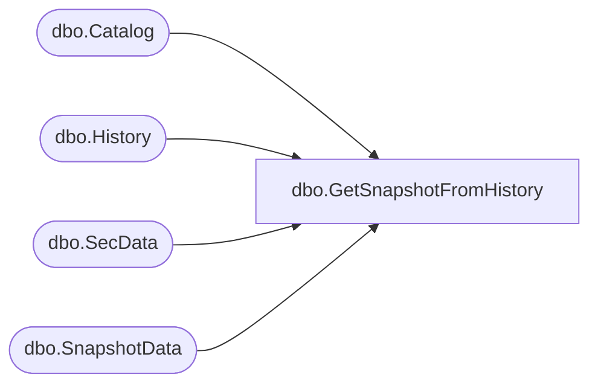

# dbo.GetSnapshotFromHistory

**Database:** ReportServerBIRPT02  
**Server:** bearcluster01  

## Architecture Diagram



## Table Dependencies

| Referenced Table |
|---|
| dbo.Catalog |
| dbo.History |
| dbo.SecData |
| dbo.SnapshotData |

## Stored Procedure Code

```sql
CREATE PROCEDURE [dbo].[GetSnapshotFromHistory]
@Path nvarchar (425),
@SnapshotDate datetime,
@AuthType int
AS
SELECT
   Catalog.ItemID,
   Catalog.Type,
   SnapshotData.SnapshotDataID,
   SnapshotData.DependsOnUser,
   SnapshotData.Description,
   SecData.NtSecDescPrimary,
   Catalog.[Property],
   SnapshotData.ProcessingFlags
FROM
   SnapshotData
   INNER JOIN History ON History.SnapshotDataID = SnapshotData.SnapshotDataID
   INNER JOIN Catalog ON History.ReportID = Catalog.ItemID
   LEFT OUTER JOIN SecData ON Catalog.PolicyID = SecData.PolicyID AND SecData.AuthType = @AuthType
WHERE
   Catalog.Path = @Path
   AND History.SnapshotDate = @SnapshotDate
```

