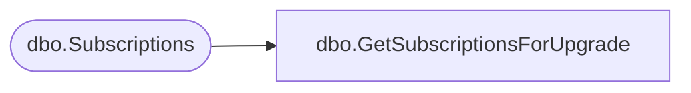

# dbo.GetSubscriptionsForUpgrade

**Database:** ReportServerBIRPT02  
**Server:** bearcluster01  

## Architecture Diagram



## Table Dependencies

| Referenced Table |
|---|
| dbo.Subscriptions |

## Stored Procedure Code

```sql
CREATE PROCEDURE [dbo].[GetSubscriptionsForUpgrade]
@CurrentVersion int
AS
SELECT
    [SubscriptionID]
FROM
    [Subscriptions]
WHERE
    [Version] != @CurrentVersion
```

